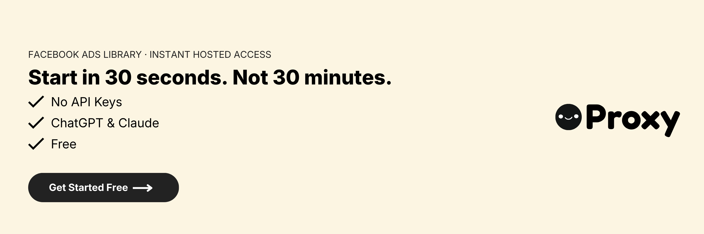

[](https://useproxy.dev/)

# Facebook Ads Library MCP Server

This is a Model Context Protocol (MCP) server for the Facebook Ads Library.

With this you can search Facebook's public ads library for any company or brand, see what they're currently running and analyze their advertising. You can analyze ad images/text, analyze video ads with comprehensive insights, compare companies' strategies, and get insights into what's working in their campaigns.

Here's an example of what you can do when it's connected to Claude.

[https://github.com/user-attachments/assets/a47aa689-e89d-4d4b-9df7-6eb3a81937ee](https://github.com/user-attachments/assets/a47aa689-e89d-4d4b-9df7-6eb3a81937ee)

---

## Hosted Version

Don't want to manage API keys or run anything yourself? **[Proxy](https://useproxy.dev/)** offers a fully hosted version of this MCP — no setup, no infrastructure, no separate ads data subscription.

- Works out of the box in ChatGPT, Claude, Manus, and anywhere else that supports MCP
- Nothing to install or configure — just connect and start querying
- [Start for free here](https://useproxy.dev/)

If you'd rather self-host, the full setup instructions are below.

---

## Example Prompts

### Single Brand Analysis

```plaintext
How many ads is 'AnthropicAI' running? What's their split across video and image?
```

```plaintext
What messaging is 'AnthropicAI' running right now in their ads?
```

```plaintext
Analyze the video ads from 'Nike' and extract their visual storytelling strategy, pacing, and brand messaging techniques.
```

### Batch Analysis (New!)

```plaintext
Compare the current advertising strategies across Nike, Adidas, and Under Armour. Show me their ad volumes, messaging themes, and creative approaches.
```

```plaintext
Do a deep comparison to the messaging between 'AnthropicAI', 'Perplexity AI' and 'OpenAI'. Give it a nice forwardable summary.
```

```plaintext
Analyze the holiday campaign strategies for Coca-Cola, Pepsi, Dr Pepper, and Sprite. What themes are they using?
```

```plaintext
Get the current ads for all major streaming services: Netflix, Disney+, Hulu, HBO Max, Amazon Prime Video, and Apple TV+. Compare their positioning strategies.
```

---

## Installation

### Prerequisites

- Python 3.12+
- Anthropic Claude Desktop app (or Cursor)
- Pip (Python package manager), install with `python -m pip install`
- An API key for an ads data provider, set as `SCRAPECREATORS_API_KEY` (see configuration below)
- A Google Gemini API key for video analysis (optional, only needed for video ads)

> Prefer not to deal with API keys? See the [Hosted Version](#hosted-version) above to skip setup entirely.

### Quick Install (Recommended)

1. **Clone and run the install script**
  ```bash
   git clone http://github.com/talknerdytome-labs/facebook-ads-library-mcp.git
   cd facebook-ads-library-mcp

   # For macOS/Linux:
   ./install.sh

   # For Windows:
   install.bat
  ```
   The install script will:
  - Create a virtual environment for dependency isolation
  - Install all required dependencies
  - Set up your configuration files
2. **Configure your API keys**
  Edit the `.env` file that was created and add your API keys:
  - Set your ads data API key as `SCRAPECREATORS_API_KEY`
  - Get your Gemini API key at [Google AI Studio](https://aistudio.google.com/app/apikey) (optional, for video analysis)
3. **Follow the displayed MCP configuration**
  The install script will show you the exact configuration to add to Claude Desktop or Cursor.

### Manual Install

If you prefer to install manually:

1. **Clone this repository**
  ```bash
   git clone https://github.com/trypeggy/facebook-ads-library-mcp.git
   cd facebook-ads-library-mcp
  ```
2. **Create a virtual environment and install dependencies**
  ```bash
   python3 -m venv venv
   ./venv/bin/pip install -r requirements.txt
  ```
3. **Configure API keys**
  Copy the template and configure your API keys:
   **To obtain API keys:**
  - Set your ads data API key as `SCRAPECREATORS_API_KEY` in the `.env` file
  - Get a Google Gemini API key [here](https://aistudio.google.com/app/apikey) (optional, for video analysis)
4. **Connect to the MCP server**
  Add the MCP server configuration to your Claude Desktop or Cursor config:
   Replace `{{PATH_TO_PROJECT}}` with the full path to where you cloned this repository.
   **Note:** The configuration uses the virtual environment's Python interpreter (`venv/bin/python`) for better dependency isolation and reliability.
   **Note:** API keys are now automatically loaded from the `.env` file, so you don't need to pass them as command line arguments.
   **For Claude Desktop:**
   Save this as `claude_desktop_config.json` in your Claude Desktop configuration directory at:
   **For Cursor:**
   Save this as `mcp.json` in your Cursor configuration directory at:
5. **Restart Claude Desktop / Cursor**
  Open Claude Desktop and you should now see the Facebook Ads Library as an available integration.
   Or restart Cursor.

---

## Technical Details

1. Claude sends requests to the Python MCP server
2. The MCP server intelligently batches and optimizes queries to the ads data API
3. Smart caching reduces redundant API calls and improves performance
4. Credit monitoring prevents workflow interruption with proactive error handling
5. Data flows back through the chain to Claude with enhanced batch information

### Available MCP Tools (Enhanced)

This MCP server provides tools for interacting with Facebook Ads library objects:


| Tool Name                 | Description                                                                | Batch Support           |
| ------------------------- | -------------------------------------------------------------------------- | ----------------------- |
| `get_meta_platform_id`    | Returns platform ID given one or many brand names                          | ✅ Multiple brands       |
| `get_meta_ads`            | Retrieves ads for specific page(s) (platform ID)                           | ✅ Multiple platform IDs |
| `analyze_ad_image`        | Analyzes ad images for visual elements, text, colors, and composition      | ⚡ Enhanced caching      |
| `analyze_ad_video`        | Analyzes single ad video using Gemini AI for comprehensive insights        | ⚡ Enhanced caching      |
| `analyze_ad_videos_batch` | **NEW** - Analyzes multiple videos in single API call for token efficiency | 🎬 ~88% token savings   |
| `get_cache_stats`         | Gets statistics about cached media (images and videos) and storage usage   | -                       |
| `search_cached_media`     | Searches previously analyzed media by brand, colors, people, or media type | -                       |
| `cleanup_media_cache`     | Cleans up old cached media files to free disk space                        | -                       |

---

## Troubleshooting

### Common Issues

**🆕 API Credits Exhausted:**

- When you see an "API credits exhausted" message, you need to top up your account
- The error message includes a direct link to your provider's dashboard
- You can check your current credit balance and purchase more credits there
- The server will automatically resume working once credits are available

**🆕 Rate Limit Exceeded:**

- If you hit rate limits, the server will tell you how long to wait
- Batch operations help reduce the chance of hitting rate limits
- Consider spacing out large batch requests if you frequently hit limits

**API Key Not Found Error:**

- Ensure your `.env` file is in the project root directory
- If you don't have a `.env` file, copy it from the template: `cp .env.template .env`
- Check that your API keys are correctly formatted without quotes
- Verify the `.env` file contains `SCRAPECREATORS_API_KEY=your_key_here`
- For video analysis, ensure `GEMINI_API_KEY=your_key_here` is also added

**Video Analysis Not Working:**

- Confirm you have a valid Google Gemini API key in your `.env` file
- Video analysis requires the `GEMINI_API_KEY` environment variable

**MCP Server Connection Issues:**

- Verify the path in your MCP configuration points to the correct location
- Make sure you've created a virtual environment and installed dependencies with `python3 -m venv venv && ./venv/bin/pip install -r requirements.txt`
- Ensure your MCP configuration uses the virtual environment Python path (ending with `/venv/bin/python`)
- Restart Claude Desktop/Cursor after configuration changes

For additional Claude Desktop integration troubleshooting, see the [MCP documentation](https://modelcontextprotocol.io/quickstart/server#claude-for-desktop-integration-issues). The documentation includes helpful tips for checking logs and resolving common issues.

---

## Feedback

Your feedback will be massively appreciated. Please [tell us](mailto:support@useproxy.dev) which features on that list you like to see next or request entirely new ones.

---

## License

This project is licensed under the MIT License.

License
Python